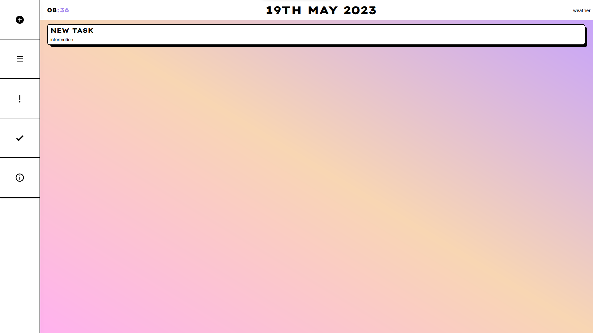

# Neo To-Do List

A classic to-do list created with the popular "Neo-Brutalism" web design. This to do list has a number of features including...

-   Task list
-   Five sidebar options; Create new task, Current tasks, Tasks due today, Completed tasks, and About page
-   Date and time tracking
-   Weather tracking based on location (WIP)
-   Ability to delete and edit tasks (WIP)

## Tech Stack

-   React and Next.js 13
-   Tailwind
-   Pocketbase

## Preview

**Tasks page**

**Completed Page**

**New Task Page (WIP)**

**Tasks Due, About Pages Coming soon!**

## Colour Palette and Inspiration

As mentioned, this to-do list follows a neo-brtualist design pattern. I took heavy inspiration by a design by **Girogi Migriauli**

## How to use?

At the moment, I don't have this project built on Vercel yet. However, if you would like to try this yourself:

Clone the repository

`git clone https://github.com/Joecey/neo-todo-list.git`

Navigate to new directory and install required packages

`cd neo-todo-list`

`npm install`

In one terminal, start Pocketbase

`./pocketbase serve`

And in a second terminal, run the to-do list

`npm run dev`
